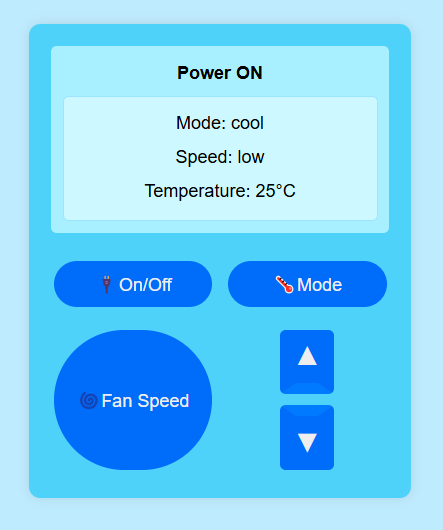

# iZONE Assessment - TING Edition
The iZone Controller UI, TING Edition, simplifies management and control of iZone systems. Easily adjust mode, fan speed, and temperature settings for enhanced comfort and energy efficiency.

## Setting Up Your Own Development Environment

Install [Visual Studio Code](https://code.visualstudio.com/) or your preferred IDE.

Install [Node.js](https://nodejs.org/en/download/).

```powershell
> # When not stated, all commands are assumed to be run on PowerShell
> npm i -g pnpm # install PnpM, this should be the only time you use npm
> pnpm i -g typescript # install TypeScript
> pnpm i -g npm-check-updates # install functionality for updating local packages
```

Git clone the projects you are assigned to. Read the `README` of those projects.

```powershell
> # On a fresh clone, you will need to install all required dependencies first
> pnpm i  # ( or `yarn`)
```

## Developing

Once you've done setting up a project and installed dependencies , start a development server:

```bash
# Start the server and open the app in a new browser tab
pnpm dev
```

## iZone Controller User Interface
TING Edition
<br>

<br>